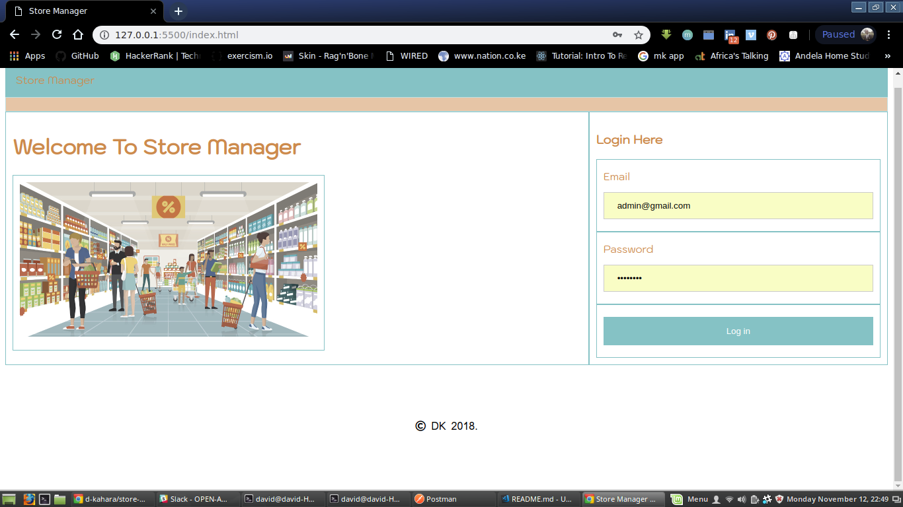
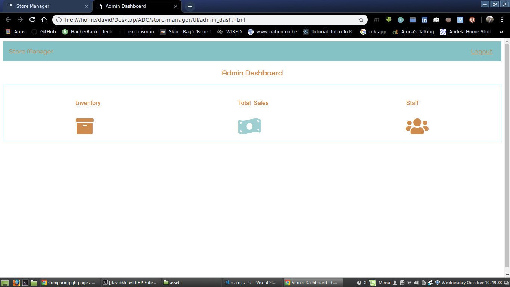
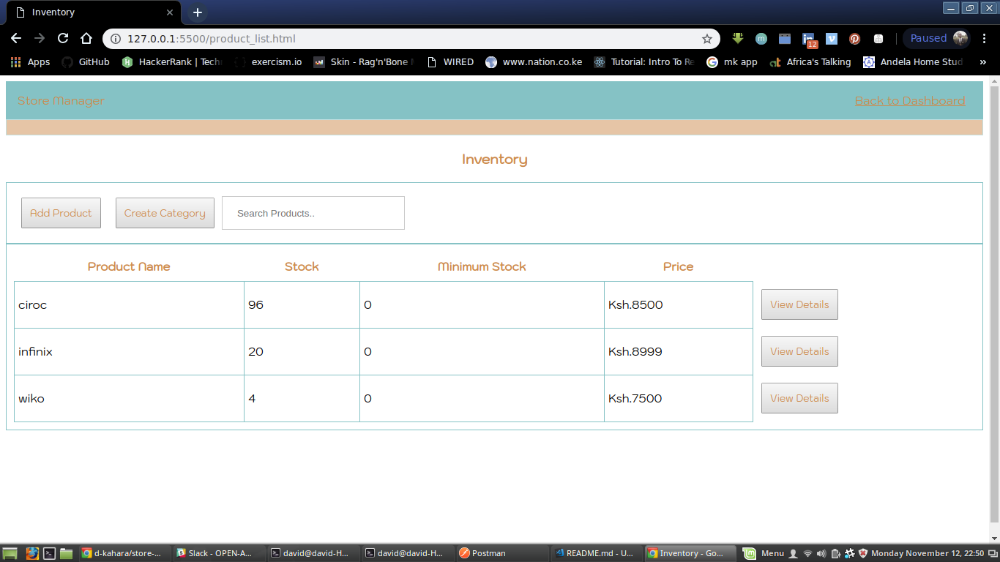
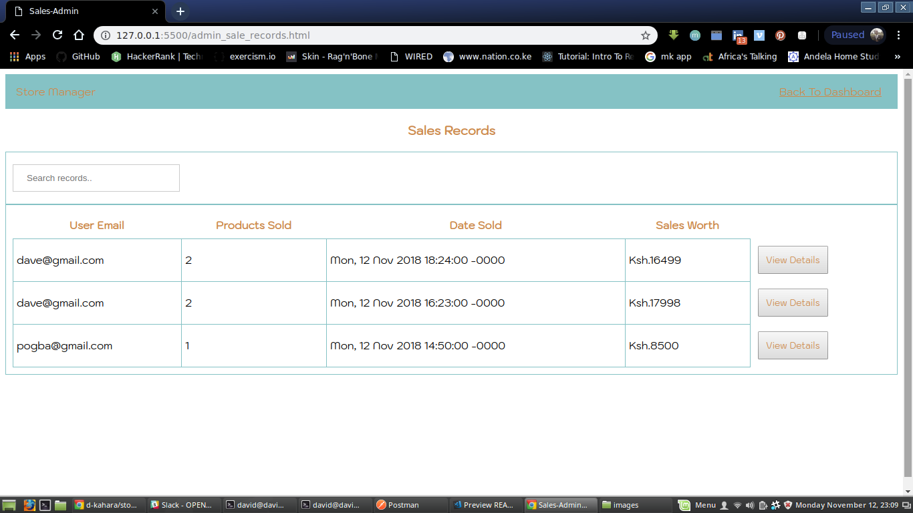
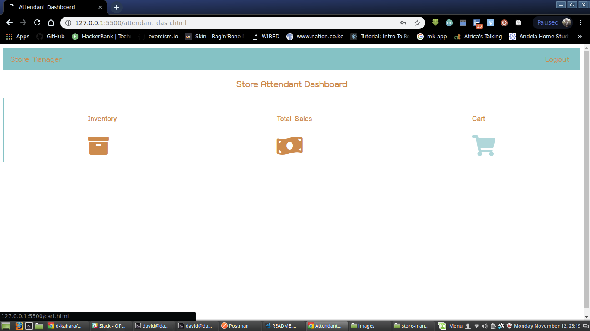
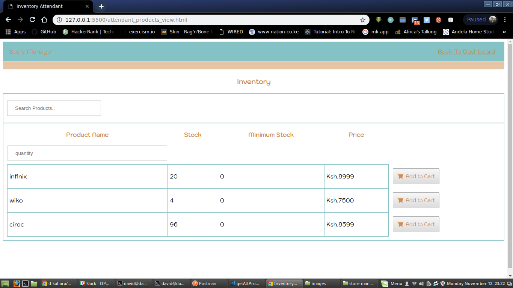
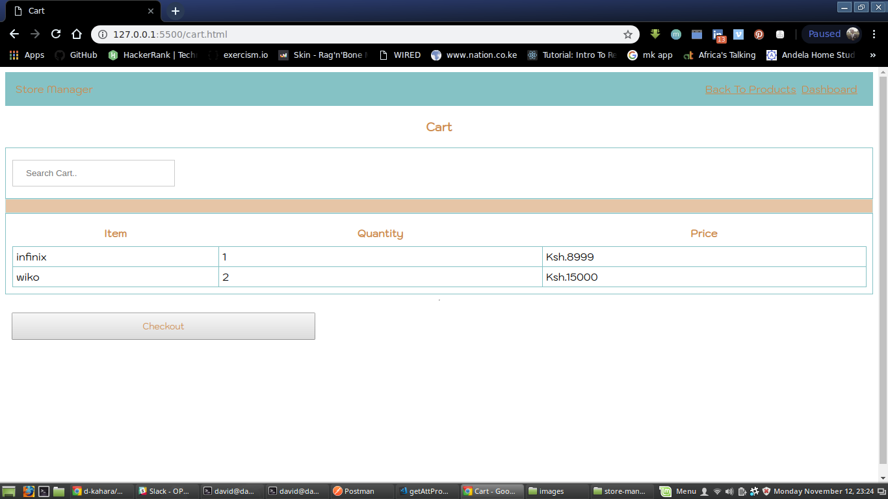

# Store-manager-UI

The User Interface for the Store Manager Application 

## Getting Started

These instructions will provide you with a copy of the project locally for development and testing purposes.

```
git clone https://github.com/d-kahara/store-manager-UI.git
Navigate to the folder where you cloned it into then open the index.html file in your browser
```
* Credentials
    ```
    email:      'admin@gmail.com'
    password:   'password'
    ```

## App Screenshots 

## Landing page

> Users enter their credentials here for verification. This page leads to the respective dashboards



## Admin dashboard

> All users with admin privileges are redirected here




## Products page

> All products in inventory are listed here




## Sales page

> All sales made by store attendants are listed here



## Attendant dashboard

> All store attendants are redirected here




## Attendant Inventory

> store attendants view inventory here




## Checkout cart

> Store attendants make sale orders here



## Author

- **David Kahara**   - [d-kahara](https://github.com/d-kahara)


## License

This project is licensed under the MIT License